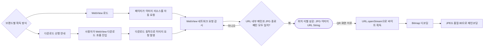
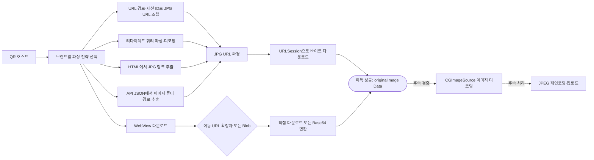

# QR 이미지 획득·화이트리스트 기준

이 문서는 QR 인식이나 사진 업로드 전체 과정이 아니라, **각 브랜드의 QR에서 실제 네컷사진을 가리키는 URL 또는 이미지 데이터를 어떻게 찾아내는지**만 정리한다.

- Android 확인 기준: `d1fedbc330a3c1ac97f9957abc867222bd917747`
- iOS 확인 기준: `8f8a74216234d9d0751818d31ee2775d8bdae71e`
- 이 문서에서 **이미지 획득 성공**은 Android에서는 이미지 URL `String`, iOS에서는 이미지 바이트 `Data`를 얻은 시점이다.
- QR 인식, 다운샘플링, 업로드, 사진 추가 성공 여부는 범위에서 제외한다.

코드를 비교할 때는 다음 세 단계를 구분해야 한다.

| 단계 | 의미 | Android | iOS |
| --- | --- | --- | --- |
| 이미지 위치 식별 | 실제 사진이 있는 위치를 찾음 | WebView 요청에서 JPG URL 발견 | 브랜드별 파서가 JPG URL 계산·추출, 또는 WebView가 이미지 이동 감지 |
| 이미지 바이트 획득 | 사진 응답을 메모리로 다운로드 | QR 화면 이후 공통 업로드 흐름에서 수행 | 파서 또는 WebView가 수행하여 `Data` 반환 |
| 실제 이미지 검증 | 응답이 디코딩 가능한 이미지인지 확인 | `BitmapFactory` 디코딩 단계 | `CGImageSourceCreateWithData` 단계 |

## Android

Android는 브랜드별 네이티브 파서를 사용하지 않는다. 모든 지원 브랜드가 QR URL을 WebView로 열고, `shouldInterceptRequest()`가 발생한 네트워크 요청 중 **이미지 호스트·경로 패턴과 파일명 종료 패턴이 모두 일치하는 URL**을 찾는다.

### 이미지 획득 방식

두 방식의 차이는 이미지 요청을 발생시키는 계기뿐이다.

- **WebView → 이미지 획득**: 페이지 로드만으로 사진 리소스 요청이 발생한다.
- **WebView → 다운로드 → 이미지 획득**: 먼저 다운로드 안내를 보여주고, 사용자가 다운로드 흐름에 들어가야 사진 요청이 발생한다.
- 여기서 “다운로드”는 Android `DownloadManager`나 WebView `DownloadListener`로 파일 저장 완료를 감지하는 기능이 아니다. 안내 후 같은 WebView로 진입하고, 사용자의 웹 동작으로 발생한 요청을 기존 `shouldInterceptRequest()`가 잡는다.
- 어느 방식이든 앱이 이 단계에서 JPG 파일 바이트를 다운로드하거나 디코딩하지는 않는다. 조건에 맞는 URL 문자열만 반환한다.

### 브랜드별 규칙

| 브랜드 | 획득 방식 | QR 진입 URL 패턴 | 이미지 URL 포함 패턴 | 파일명 종료 패턴 | 획득 결과 |
| --- | --- | --- | --- | --- | --- |
| 포토이즘 | WebView 자동 요청 | `qr.seobuk.kr/s/` | `photoism-cms-prd.s3.ap-northeast-2.amazonaws.com` | `.jpg` | JPG URL `String` |
| 인생네컷 | WebView 자동 요청 | `api.life4cut.net/` | `release-renewal-s3.s3.ap-northeast-2.amazonaws.com/QRimage` | `image.jpg` | JPG URL `String` |
| 하루필름 | WebView 자동 요청 | `haru4.mx2.co.kr/` | `haru4.mx2.co.kr/download/album/` | `.jpg` | JPG URL `String` |
| 포토시그니처 구형 | 다운로드 선행 안내 | `photoqr3.kr/` | `photoqr3.kr/R/` | `a.jpg` | JPG URL `String` |
| 포토시그니처 뷰어 | 다운로드 선행 안내 | `photosignature-viewer.web.app` | `photosignature-asset-cdn.photosignature.workers.dev/sessions/` | `final.jpg` | JPG URL `String` |
| 포토그레이 | 다운로드 선행 안내 | `pgshort.aprd.io/` | `pg-qr-resource.aprd.io` | `image.jpg` | JPG URL `String` |
| 모노맨션 | 다운로드 선행 안내 | `qr.mono-mansion.com/` | `ncloudstorage.com` | `COMPLETE.jpg` | JPG URL `String` |

현재 Android 화이트리스트는 전부 JPG다. 모노맨션만 URL 포함·종료 비교에서 대소문자를 무시하고, 나머지는 대소문자를 구분한다.

### Android에서 실제로 확인하는 것

- QR 브랜드 판별: QR 원문 URL이 브랜드별 진입 패턴을 포함하는지 확인
- 사진 판별: WebView 요청 URL이 브랜드별 이미지 패턴을 포함하면서 지정된 JPG 파일명으로 끝나는지 확인
- 결과: `QRScanResult.QRCodeScanned(imageUrl: String)`
- 확인하지 않는 것: 응답 `Content-Type`, JPG magic bytes, 실제 이미지 디코딩 가능 여부

따라서 Android에서 말하는 “JPG”는 현재 **URL 파일명 규칙으로 추정한 형식**이다. 이 시점에는 실제 응답 바이트가 JPG인지 검증하지 않는다.

QR 화면 이후에는 URL을 `openStream()`으로 내려받아 `BitmapFactory`로 디코딩하고, 기본 `ContentType.JPEG`와 품질 80으로 다시 인코딩한다. 업로드 파일명은 `.jpeg`, MIME은 `image/jpeg`가 된다. 즉 Android는 **JPG처럼 보이는 URL 식별 → 이미지 바이트 다운로드 → JPEG 정규화**의 세 단계다.

## iOS

iOS는 QR 호스트와 일치하는 브랜드별 파싱 전략을 선택한다. 각 전략이 사진 URL을 계산·추출한 뒤 직접 다운로드하고, 성공 결과를 `ParsedQRResult.originalImage: Data`로 통일한다.

전략 선택은 선언된 `strategyType`이 아니라 등록 배열 순서와 `host.contains(keyword)`의 최초 일치로 결정된다. 따라서 현재 호스트 목록은 엄밀한 exact-host 화이트리스트가 아니라 부분 문자열 matcher다.

### 이미지 획득 방식

### 브랜드별 파싱 규칙

| 브랜드 | QR 호스트 화이트리스트 | 파싱 방식 | 실제 사진 식별 규칙 | 예상 형식 | 획득 결과 |
| --- | --- | --- | --- | --- | --- |
| 아우라픽 | `pos.aurapic.co.kr`, `aurapic.co.kr` | API JSON | 쿼리 `s` → 촬영 데이터 API → `urlFolderPath` → `/api/data-download{folder}/image.jpg` | JPG | `Data` |
| 하루필름 | `haru.mx2.co.kr`, `haru1~4.mx2.co.kr` | URL 조립 | QR 경로에서 ID 추출 → `/download/album/{id}/output/output.jpg` | JPG | `Data` |
| 포토그레이 | `aprd.io`, `pgshort.aprd.io` | 리다이렉트·Base64 파싱 | 최종 URL의 `id`를 Base64 디코딩 → `sessionId` → `pg-qr-resource.aprd.io/{sessionId}/image.jpg` | JPG | `Data` |
| 포토시그니처 CODE | `imagenetworks.web.app` | URL 조립 | 경로 `/v/{sessionID}` 검증 → CDN `/sessions/{sessionID}/final.jpg` | JPG | `Data` |
| 포토시그니처 구형 | `photoqr3.kr` | URL 치환·추가 | `index.html`을 `a.jpg`로 치환하거나 URL 뒤에 `/a.jpg` 추가 | JPG | `Data` |
| 포토시그니처 뷰어 | `photosignature-viewer.web.app` | 세션 ID 추출 | fragment 또는 path의 `view/{sessionID}` → CDN `/sessions/{sessionID}/final.jpg` | JPG | `Data` |
| 인생네컷 | `life4cut.net`, `api.life4cut.net`, `life-4cut.net` | 리다이렉트 쿼리 파싱 | 최종 URL의 `bucket`, `region`, `folderPath` → S3 `{folderPath}/image.jpg`; Referer 필요 | JPG | `Data` |
| 모노맨션 | `qr.mono-mansion.com` | HTML 정규식 | HTML의 `href`에서 `ncloudstorage.com`을 포함하고 `.jpg`로 끝나는 링크 추출 | JPG | `Data` |
| 포토이즘 | `seobuk.kr` | WebView 전용 | 사용자의 다운로드 이동 URL 확장자가 `jpg/jpeg/png/heic/webp`이면 직접 다운로드; `blob:`이면 fetch 후 Base64를 `Data`로 변환 | JPG·JPEG·PNG·HEIC·WebP 또는 Blob 원본 형식 | `Data` |

플랜비스튜디오는 enum에는 존재하지만 호스트 키워드와 파싱 전략이 없어 현재 iOS QR 화이트리스트에는 포함되지 않는다.

### iOS에서 실제로 확인하는 것

- 네이티브 전략: 대부분 HTTP 성공 상태와 다운로드 성공 여부를 확인하고 `.jpg` URL의 응답 바이트를 그대로 `Data`로 반환
- 아우라픽: HTTP 성공과 비어 있지 않은 응답 바이트까지 확인
- WebView 직접 URL: `jpg`, `jpeg`, `png`, `heic`, `webp` 확장자 확인
- WebView Blob: `text/html`만 제외하고 Base64 디코딩
- WebView는 자동 이미지 크롤러가 아니라 다운로드 페이지를 열고 사용자의 이미지 다운로드 navigation을 가로채는 방식
- 네이티브 파서 성공 시점에는 응답 `Content-Type`, magic bytes 또는 실제 JPEG 디코딩 여부를 확인하지 않음
- 획득 후 `CGImageSourceCreateWithData`가 성공해야 실제 이미지로 디코딩되며, 업로드 전에는 모두 JPEG로 재인코딩됨

따라서 iOS에서 네이티브 파서가 반환하는 “JPG”도 사진 URL의 파일명 규칙에 따른 예상 형식이다. **실제 이미지라는 첫 강한 검증은 후속 `CGImageSource` 디코딩 단계**다.

### iOS WebView 대체 흐름 주의점

- 포토이즘은 네이티브 파싱을 시도하지 않고 항상 WebView로 보낸다.
- 모노맨션·포토시그니처·포토시그니처 CODE는 URL 추출이나 다운로드 조건이 맞지 않을 때 WebView 대체 오류를 유지한다.
- 아우라픽은 토큰·API·폴더 경로 추출 실패 시 WebView로 보내지만, 최종 이미지 다운로드 실패는 만료·다운로드 실패로 처리한다.
- 하루필름·인생네컷·포토그레이는 이미지 응답 실패 때 WebView 대체 오류를 던지는 코드가 있어도 같은 블록의 광범위한 `catch`가 이를 이미지 다운로드 실패로 바꾼다. 현재 실행 결과는 자동 WebView 대체가 아니라 만료 처리에 가깝다.

화이트리스트 관리에서는 단순한 “WebView 대체 O/X”가 아니라 **호스트 판별 실패, 식별자 추출 실패, 이미지 URL 생성 실패, 이미지 응답 실패** 단계별 정책을 구분해야 한다.

## Android와 iOS의 차이

| 구분 | Android | iOS |
| --- | --- | --- |
| 이미지 위치 식별 | WebView의 모든 요청에서 URL 패턴 감시 | 브랜드별 코드가 URL을 계산·추출하거나 WebView 다운로드 사용 |
| 획득 결과 | 이미지 URL `String` | 다운로드된 이미지 `Data` |
| 현재 네이티브 예상 형식 | 전부 JPG | 전부 JPG |
| WebView 허용 형식 | 브랜드 설정상 JPG만 | JPG, JPEG, PNG, HEIC, WebP, Blob |
| 실제 바이트 검증 | 이미지 URL 식별 단계에는 없음 | 획득 단계에는 약함; 후속 `CGImageSource`에서 실제 이미지 디코딩 |
| 사용자 다운로드가 필요한 분기 | 포토시그니처·포토그레이·모노맨션 | 네이티브 파서 실패 또는 포토이즘 WebView에서 수동 다운로드 |

현재 두 플랫폼 모두 입력 호스트를 `contains`로 비교하는 구간이 있어 유사한 악성 호스트 문자열까지 일치할 수 있다. 실제 화이트리스트로 전환할 때는 정규화된 exact host 또는 허용된 하위 도메인 suffix 비교가 필요하다.

## 화이트리스트 관리에 필요한 정보

브랜드 단위의 단순 “QR 지원 O/X”만으로는 현재 규칙을 관리할 수 없다. 최소한 다음 항목을 플랫폼별·브랜드 변형별로 구분해야 한다. 이는 API 필드명을 확정한 것이 아니라 관리 화면과 어댑터가 다뤄야 할 개념 경계다.

| 관리 정보 | 용도 |
| --- | --- |
| QR 진입 호스트·경로 | 어떤 QR을 해당 브랜드로 라우팅할지 결정 |
| 이미지 획득 방식 | WebView 자동 감지, 사용자 다운로드, URL 조립, 리다이렉트 파싱, HTML 추출, API JSON, WebView Blob 구분 |
| 이미지 호스트·경로 규칙 | 최종 사진 위치를 허용할 범위 |
| 파일명·확장자 허용 목록 | JPG·PNG·HEIC·WebP 등 허용 형식 |
| 파싱 규칙 | query key, path 위치, Base64 여부, HTML 정규식, URL 템플릿 |
| 대소문자 비교 | Android 모노맨션처럼 예외가 있는 규칙 처리 |
| 필수 요청 헤더 | 인생네컷 Referer 같은 다운로드 조건 |
| 획득 결과 형태 | URL 문자열 또는 이미지 바이트 |
| WebView 대체 여부 | 네이티브 파싱 실패 시 수동 다운로드를 허용할지 결정 |
| 활성 상태·검증일 | 변경된 브랜드 URL 규칙을 운영에서 켜고 최근 검증 시점을 확인 |
| 샘플 QR·예상 결과 | 규칙 변경 시 QR에서 예상 이미지 URL 또는 이미지 `Data`를 다시 얻는 회귀 검증 |

화이트리스트를 서버에서 관리하게 되더라도 정규식이나 임의 URL 템플릿을 앱에서 그대로 실행시키는 구조는 피해야 한다. 관리 화면에는 사람이 이해할 수 있는 규칙을 저장하고, 앱의 제한된 파서 종류와 검증된 호스트·경로 규칙으로 변환하는 어댑터 경계를 두는 것이 안전하다.

## 코드 근거

### Android

- [QR 이미지 감지 규칙](/Users/ikseong/Desktop/develop/Project/Neki/27th-App-Team-2-Android/docs/qr-image-detection.md)
- [QRScanViewModel.kt](/Users/ikseong/Desktop/develop/Project/Neki/27th-App-Team-2-Android/feature/photo-upload/impl/src/main/java/com/neki/android/feature/photo_upload/impl/qrscan/QRScanViewModel.kt)
- [PhotoWebViewClient.kt](/Users/ikseong/Desktop/develop/Project/Neki/27th-App-Team-2-Android/feature/photo-upload/impl/src/main/java/com/neki/android/feature/photo_upload/impl/qrscan/util/PhotoWebViewClient.kt)
- [QRScanResult.kt](/Users/ikseong/Desktop/develop/Project/Neki/27th-App-Team-2-Android/feature/photo-upload/api/src/main/java/com/neki/android/feature/photo_upload/api/QRScanResult.kt)
- [UploadSinglePhotoUseCase.kt](/Users/ikseong/Desktop/develop/Project/Neki/27th-App-Team-2-Android/core/domain/src/main/java/com/neki/android/core/domain/usecase/UploadSinglePhotoUseCase.kt)
- [ByteArray.kt](/Users/ikseong/Desktop/develop/Project/Neki/27th-App-Team-2-Android/core/common/src/main/java/com/neki/android/core/common/util/ByteArray.kt)

### iOS

- [브랜드·호스트 정의](https://github.com/Team-Neki/Neki-iOS/blob/8f8a74216234d9d0751818d31ee2775d8bdae71e/Neki-iOS/Features/QRCodeScanner/Sources/Domain/Sources/Entities/QRCodeBrand.swift)
- [파싱 전략 선택](https://github.com/Team-Neki/Neki-iOS/blob/8f8a74216234d9d0751818d31ee2775d8bdae71e/Neki-iOS/Features/QRCodeScanner/Sources/Data/Sources/Repositories/DefaultQRCodeScanRepository.swift)
- [브랜드별 파싱 전략](https://github.com/Team-Neki/Neki-iOS/tree/8f8a74216234d9d0751818d31ee2775d8bdae71e/Neki-iOS/Features/QRCodeScanner/Sources/Data/Sources/Strategies/Implementations)
- [WebView 이미지 다운로드](https://github.com/Team-Neki/Neki-iOS/blob/8f8a74216234d9d0751818d31ee2775d8bdae71e/Neki-iOS/Features/QRCodeScanner/Sources/Presentation/Sources/Views/DownloadableWebView.swift)
- [실제 이미지 디코딩·JPEG 변환](https://github.com/Team-Neki/Neki-iOS/blob/8f8a74216234d9d0751818d31ee2775d8bdae71e/Neki-iOS/Features/QRCodeScanner/Sources/Domain/Sources/Utilities/ImageDownsamplingProcessor.swift)
